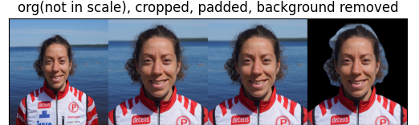
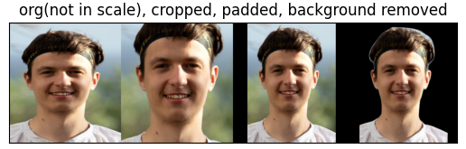

# VL runner image crop

From user uploaded images of runners, resize crop (and remove background).




## Basic Usage

The main file is the `crop_images.py`. In beginning the target image size and wanted scaling of the face are defined. 

**NOTE:** Background removal requires additional library ([rembg](https://github.com/danielgatis/rembg)) (using neural nets on CPU) and its SLOW.

`get_runners_ansync.py` provides utilities to anyncronously check if there is any updated images after latest run. The eventual loading of the image is still syncronous.

## Installation

1. Clone the repository:
    ```sh
    git clone https://github.com/teemueer/VL
    cd VL/image_process
    ```

2. Create and activate virtual environment with dependencies installed, Note thant rembg is not installed here.
    ```sh
    ./venv.cmd
    ```

Notes on backgroud removal:
- For installing the GPU version of `rembg`, refer to the [Installation Guide](https://github.com/danielgatis/rembg#installation).

## Running `crop_images.py`

To run the `crop_images.py` script, use the following options:
```sh
usage: crop_images.py [-h] [--latest_run LATEST_RUN] [--output_path OUTPUT_PATH] [--rem_bg]
                      [--originals_folder ORIGINALS_FOLDER]

options:
  -h, --help            show this help message and exit
  --latest_run LATEST_RUN
                        Takes only images updated after latest run! Optional parameter, latest run datetime,   
                        format "YYYY-MM-DD HH:MM:SS". If not provided, the latest run will be read from        
                        "latest_run.txt" or set to beginning of time
  --output_path OUTPUT_PATH
                        output path to save images. Original, crop and background removed images will be       
                        saved to 'output_path/originals', 'output_path/crop' and 'output_path/bg'
                        respectively
  --rem_bg              remove background, NOTE: This is a lot slower and results vary
  --originals_folder ORIGINALS_FOLDER
                        if given load images from here instead of downloading from s3
```

### Example
```sh
> python crop_images.py --output_path images/
```

Create a index file of `name;club;photos` by running.
Its now quarantined that paths in index actually contain images.
```sh
solve_img_name.py [-h] [--index_path INDEX_PATH]

Get runners from OFAN

options:
  -h, --help            show this help message and exit
  --index_path INDEX_PATH
                        Path to index file


> python solve_img_name.py
```
